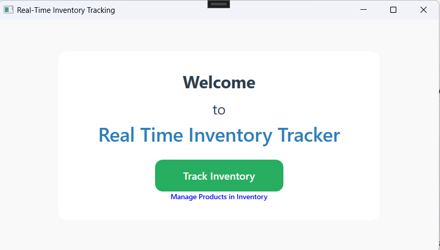
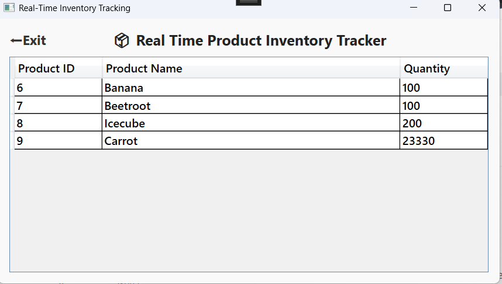
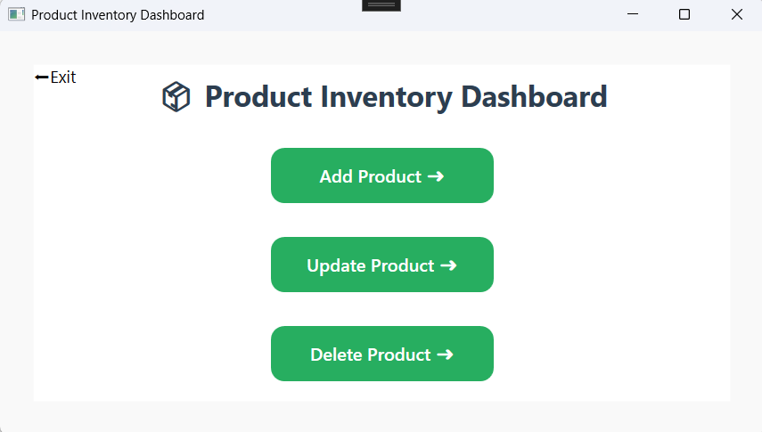
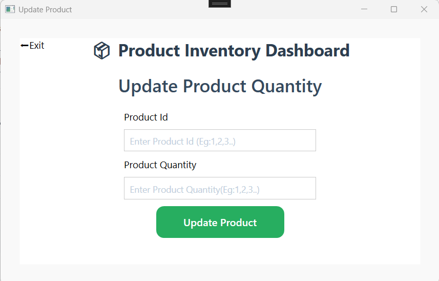
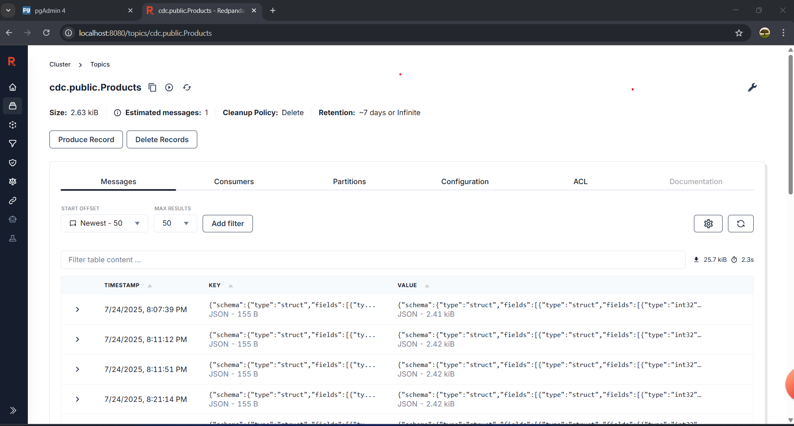

# 🧾 Real-Time Inventory Tracker 🚀✨

[](https://learn.microsoft.com/en-us/dotnet/desktop/wpf/)
[](https://dotnet.microsoft.com/)
[](https://www.postgresql.org/)
[](https://kafka.apache.org/)
[](https://debezium.io/)
[](https://www.docker.com/)

---

A full-stack real-time inventory management system built using **.NET**, **WPF**, **PostgreSQL**, **Kafka**, and **Debezium (CDC)**. This application allows multiple users to perform CRUD operations on inventory items and see live updates across all connected clients through a reactive backend.

👉 [Demo Video](https://drive.google.com/file/d/14rBUhHzBNaQYR1BSTbW76L6c5dxMnqBv/view?usp=sharing)

---

## 📚 Table of Contents

- [✨ Core Features](#-core-features)
- [🧠 System Architecture](#-system-architecture)
- [🧰 Tech Stack](#-tech-stack)
- [🗂️ Project Structure](#-project-structure)
- [📸 Project Screenshots](#-project-screenshots)
- [✅ Prerequisites](#-prerequisites)
- [🚀 Getting Started](#-getting-started)
- [⚙️ How It Works](#-how-it-works)
- [🔌 API Endpoints](#-api-endpoints)
- [🔧 Configuration](#-configuration)

---

## ✨ Core Features

- ✅ **CRUD Operations** – Add, edit, delete, and view inventory items.
- 🔁 **Real-Time UI Updates** – All connected clients receive instant updates using SignalR.
- 🖥️ **WPF Desktop Client** – Smooth desktop experience for inventory operations.
- 🧩 **Decoupled Services** – Backend components communicate via APIs and Kafka.
- 🕵️‍♂️ **Change Data Capture (CDC)** – Real-time detection of DB changes via Debezium.
- 🐳 **Fully Containerized** – Use Docker Compose to spin up all backend services.

---

## 🧠 System Architecture

The system follows **event-driven architecture** with two primary flows:

- **Command Flow**: Initiated by user (CRUD) → updates DB
- **Event Flow**: DB change → Kafka event → SignalR broadcast


---

## 🧰 Tech Stack

| Component         | Technology                      |
|------------------|----------------------------------|
| Backend API       | .NET Core, ASP.NET Core, SignalR |
| Desktop Client    | WPF (.NET)                       |
| Database          | PostgreSQL 🐘                    |
| CDC Platform      | Debezium ⚡                      |
| Messaging Broker  | Apache Kafka 🦄                 |
| Background Service| .NET Core Worker Service         |
| Containerization  | Docker & Docker Compose 🐳       |

---

## 🗂️ Project Structure

```
.
├── docker-compose.yml
├── .gitignore
├── README.md
└── RealTimeInventoryTracker.API/    # ASP.NET Core API + SignalR + Kafka Consumer Worker Service
└── RealTimeInventoryTracker.WPF/    # WPF Desktop Application
```

---

## ✅ Prerequisites

- [.NET SDK](https://dotnet.microsoft.com/en-us/download) (latest or as per `global.json`)
- [Docker Desktop](https://www.docker.com/products/docker-desktop/)
- [Postman](https://www.postman.com/) or `curl` for testing HTTP requests

---

## 🚀 Getting Started

### 1️⃣ Clone the Repository

```bash
git clone https://github.com/your-username/your-repository-name.git
cd your-repository-name
```

### 2️⃣ Start Infrastructure

```bash
docker-compose up -d
```

Wait ~3 minute for services to initialize.

### 3️⃣ Configure Debezium Connector

```bash
curl -i -X POST -H "Accept:application/json" -H "Content-Type:application/json" localhost:8083/connectors/ -d '{
  "name": "inventory-connector",
  "config": {
    "connector.class": "io.debezium.connector.postgresql.PostgresConnector",
    "plugin.name": "pgoutput",
    "database.hostname": "postgres",
    "database.port": "5432",
    "database.user": "postgres",
    "database.password": "postgres",
    "database.dbname": "inventory_db",
    "database.server.name": "dbserver1",
    "table.include.list": "public.inventory_items",
    "topic.prefix": "inventory-cdc"
  }
}'
```

This sets up Debezium to monitor the `inventory_items` table and stream changes to Kafka.

### 4️⃣ Run Backend Services

```bash
# Run API with SignalR & Kafka Consumer
cd RealTimeInventoryTracker.API/
dotnet run
```

### 5️⃣ Launch WPF Client

```bash
cd RealTimeInventoryTracker.WPF/
dotnet run
```

> 🪟 Open multiple WPF clients to test real-time sync in action! 

---

## 📸 Project Screenshots

Take a look at the core interfaces and backend visuals of the Real-Time Inventory Tracker in action:

---

### 🏠 Main Page



---

### 🔄 Real-Time Tracker View

Monitor live inventory updates across clients:



---

### 📊 Dashboard – Update Products

Manage inventory with CRUD operations:

| Dashboard | Update Product |
|-----------|----------------|
|  |  |

---

### 📡 Kafka Topics (Published Events)

Observe the Debezium CDC events flowing through Kafka topics:



---

## ⚙️ How It Works

### 🔁 User-Initiated CRUD Flow

1. User creates/updates/deletes inventory item via WPF Client.
2. API processes request and updates PostgreSQL.
3. Client receives HTTP response.

### 📡 Real-Time Update via CDC

1. PostgreSQL WAL logs the data change.
2. Debezium reads the change and sends JSON event to Kafka.
3. Kafka Consumer (Worker Service) processes the event.
4. Event pushed to SignalR hub.
5. All WPF Clients receive and render the update instantly.

---

## 🔌 API Endpoints

[](http://localhost:5000/swagger)

Refer to Swagger Documentation for Rest APIs which opens when the Backend services are ran.

SignalR Hub: `/inventoryHub` 

`NOTE`: If the project is stuck on consumer, please add a message to the connected topic via database to consume and resume the project.

---

## 🔧 Configuration

### 📁 `Inventory.Api/appsettings.json`

```json
"ConnectionStrings": {
  "DefaultConnection": "Host=localhost;Port=5432;Database=;Username=;Password="
}
```

### 📁 `Inventory.Consumer/appsettings.json`

```json
"Kafka": {
  "BootstrapServers": "localhost:9092",
  "TopicName": "inventory-cdc.public.inventory_items"
},
"SignalR": {
  "HubUrl": "http://localhost:5000/inventoryHub"
}
```

---

## 📬 Feedback & Contributions

Feel free to submit issues or pull requests. Contributions are welcome!

---

